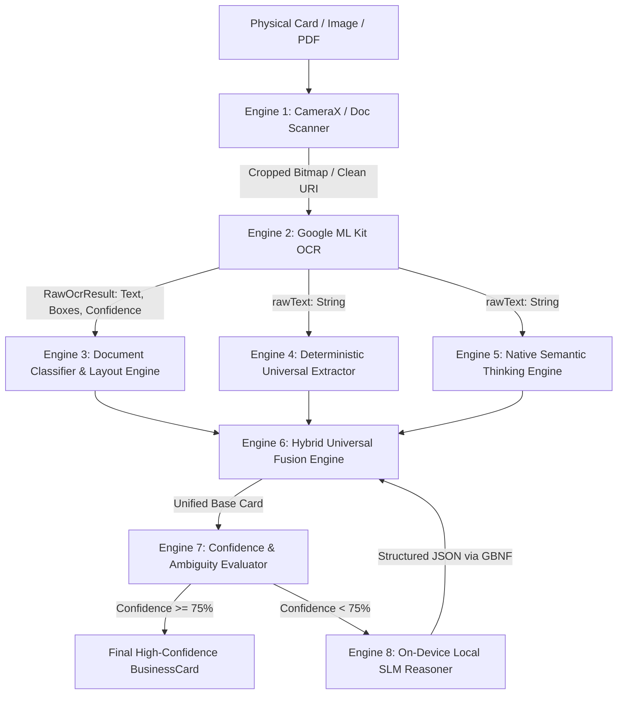

# CardLens Engine Architecture: Input Parameters, Outputs & ML Tuning Guide

This document provides a complete technical specification for **Machine Learning, Computer Vision, and NLP Engineers** looking to tighten, tune, or optimize the parameters across each active engine in the **CardLens** pipeline.

---

## 🗺️ High-Level Pipeline & Data Flow



---

## Engine 1: CameraX / Document Scanner Engine

* **Implementation File:** [`android/src/main/java/com/cardlens/CardLensModule.kt`](file:///Users/baliramshejal/react-native-card-lens/android/src/main/java/com/cardlens/CardLensModule.kt)  
* **Underlying Technology:** Google Play Services Document Scanner / CameraX  
* **Execution Environment:** Native Android (Hardware accelerated)  

### 1. Input Parameters

| Parameter | Type | Current Default | Description |
|---|---|---|---|
| `pageLimit` | `Int` | `1` (or `5`) | Maximum number of pages/cards allowed in a single session. |
| `scannerMode` | `String` | `'FULL'` | Scanner UI & post-processing mode (`FULL`, `BASE`, `BASE_WITH_FILTER`). |
| `allowGalleryImport` | `Boolean` | `true` | Allows user to pick images/PDFs directly from local storage. |
| `resultFormats` | `IntArray` | `[JPEG, PDF]` | Output file formats generated by the scanner. |

### 2. Engine Outputs

```typescript
interface ScanResult {
  imageUri: string;          // file:///.../cropped_enhanced_card.jpg
  imageUris?: string[];      // Array of URIs if multi-page scan
  pdfUri?: string;           // file:///.../scanned_document.pdf
  pageCount: number;         // e.g. 1
  width: number;             // Extracted image pixel width
  height: number;            // Extracted image pixel height
}
```

### 3. ML / CV Tightening Opportunities
* **Warp & Perspective Thresholds:** Currently governed by Google Play Services ML models for quadrilateral edge detection.
* **Filter Mode:** Switching between `SCANNER_MODE_FULL` (includes auto-enhancement, shadow removal, and contrast equalization) vs `SCANNER_MODE_BASE` if camera glare causes white-out on glossy visiting cards.

---

## Engine 2: Google ML Kit OCR Engine (Dual-Script OCR)

* **Implementation File:** [`android/src/main/java/com/cardlens/CardScannerEngine.kt`](file:///Users/baliramshejal/react-native-card-lens/android/src/main/java/com/cardlens/CardScannerEngine.kt)  
* **Underlying Technology:** Google ML Kit Text Recognition v2 (`play-services-mlkit-text-recognition`, `text-recognition-devanagari`)  
* **Execution Environment:** Native Android on-device inference (<100ms)  

### 1. Input Parameters

| Parameter | Type | Current Default | Description |
|---|---|---|---|
| `imageUri` | `String` | Required | Local file URI of the cropped image. |
| `script` | `String` | `'auto'` | Script mode: `'latin'`, `'devanagari'`, or `'auto'` (runs both). |
| `iouOverlapThreshold` | `Float` | `0.30f` (30%) | Spatial Intersection-over-Union threshold for merging Latin and Devanagari blocks. |
| `boxContainmentPadding` | `Int` | `4 px` | Tolerance margin when checking if one bounding box contains another. |

### 2. Engine Outputs

```typescript
interface RawOcrResult {
  rawText: string;            // Complete aggregated text stream
  blocks: OcrBlock[];         // Bounding-box structured hierarchy
}

interface OcrBlock {
  text: string;               // Text content of the paragraph/block
  confidence: number;         // Detection confidence (0.0 - 1.0)
  boundingBox: {
    left: number;
    top: number;
    width: number;
    height: number;
  };
  lines: OcrLine[];           // Array of lines within this block
  cornerPoints?: Point[];     // Exact polygon coordinates for skew correction
}
```

### 3. ML Tightening Opportunities
* **Confidence Gating:** Add an OCR confidence cutoff (e.g. `minLineConfidence = 0.45`) to drop low-quality background noise or watermark artifacts.
* **IoU Collision Tuning:** For mixed bilingual cards (e.g. English phone label + Devanagari shop name), adjust `iouOverlapThreshold` between `0.20f` and `0.40f` to prevent Devanagari matras from being duplicated or discarded.

---

## Engine 3: Document Classifier & Spatial Layout Engine

* **Implementation File:** [`android/src/main/java/com/cardlens/CardScannerEngine.kt`](file:///Users/baliramshejal/react-native-card-lens/android/src/main/java/com/cardlens/CardScannerEngine.kt) & [`CardLayoutParser.kt`](file:///Users/baliramshejal/react-native-card-lens/android/src/main/java/com/cardlens/CardLayoutParser.kt)  
* **Underlying Technology:** Geometric layout heuristics & lexicon-based classifier  
* **Execution Environment:** Native Android / TypeScript  

### 1. Input Parameters

| Parameter / Constant | Type | Current Value | Description |
|---|---|---|---|
| `ocrResult` | `RawOcrResult` | Required | Full blocks, lines, and spatial coordinates from Engine 2. |
| `companyHeightMultiplier` | `Float` | `3.0x` | Line font-height multiplier weighting for Company Name candidacy. |
| `topRegionBiasCutoff` | `Float` | `0.40` (Top 40%) | Lines located in the upper 40% of the card receive vertical priority for brand detection. |
| `minCompanyLength` | `Int` | `3` chars | Minimum character length for valid company names. |
| `maxCompanyLength` | `Int` | `55` chars | Maximum length to prevent paragraphs from being selected as company names. |
| `tabularColumnThreshold` | `Float` | `15 px` | Maximum horizontal deviation to cluster line-item quantities and prices for bills. |

### 2. Engine Outputs

```typescript
type DocumentType = 'card' | 'bill';

interface CardLayoutResult {
  companyName: string | null;
  tagline: string | null;
  contactPersons: Array<{ name: string; role: string | null }>;
  providedServices: string[];
  addressLines: string[];
}
```

### 3. ML Tightening Opportunities
* **Font-Height Ratios:** Calibrate `companyHeightMultiplier` (e.g. adjust between `2.5x` and `3.5x`) if large owner names overshadow smaller corporate logos.
* **Vertical Spatial Boundaries:** Adjust `topRegionBiasCutoff` from `0.40` to `0.45` to accommodate cards where logos are centered.
* **Document Classification Scoring Weights:** Fine-tune threshold weights for `cardScore` vs `billScore` (e.g. ratio of currency/tax keywords to contact/social keywords).

---

## Engine 4: Deterministic Universal Extractor Engine

* **Implementation File:** [`src/LocalCardLLM.ts`](file:///Users/baliramshejal/react-native-card-lens/src/LocalCardLLM.ts) (`extractDeterministicUniversal`)  
* **Underlying Technology:** Zero-hallucination statutory RegEx, digit transliteration tables, and string healing heuristics  
* **Execution Environment:** TypeScript Runtime (<5ms)  

### 1. Input Parameters

| Parameter | Type | Current Value | Description |
|---|---|---|---|
| `rawText` | `string` | Required | Unaltered OCR text output from Engine 2. |
| `numeralMap` | `Map<Char, Char>` | `०-९` $\to$ `0-9` | Transliteration mapping table from Devanagari numerals to ASCII digits. |
| `phoneRegex` | `RegExp` | `/(?:(?:\+?91\|0)[\s-]?)?([6-9]\d{9}\|[6-9]\d{4}\s\d{5})/g` | Standard Indian 10-digit mobile number pattern. |
| `gstinRegex` | `RegExp` | `/\b\d{2}[A-Z]{5}\d{4}[A-Z]{1}[1-9A-Z]{1}Z[0-9A-Z]{1}\b/` | Statutory 15-character Indian Goods & Services Tax pattern. |
| `pincodeRegex` | `RegExp` | `/\b[1-9][0-9]{5}\b/` | 6-digit Indian postal code format. |
| `emailRepairRules` | `Array<Rule>` | `(a)`, `[at]`, `8` $\to$ `@` | Heuristic substitutions repairing common OCR misreads around `@`. |

### 2. Engine Outputs

```typescript
interface DeterministicExtractionResult {
  phones: string[];                 // Normalized 10-digit numbers: ["8484940121", "9373129250"]
  emails: string[];                 // Clean emails: ["bharatsports29@gmail.com"]
  websites: string[];               // Domains: ["bharatsportsnagpur.com"]
  gstin: string | null;             // e.g. "27ADIPJ3019R1Z4"
  pincode: string | null;           // e.g. "440012"
  devanagariNormalizedText: string; // Text with all numerals converted to ASCII
  cleanedText: string;              // Text with noise removed
}
```

### 3. ML Tightening Opportunities
* **Phone Boundary Constraints:** Tighten regex lookbehind/lookahead to prevent 10-digit order numbers or bank account numbers from false-matching as mobile numbers.
* **GSTIN State Code Validation:** Validate the leading 2 digits against valid Indian State Codes (`01` through `38`).

---

## Engine 5: Native Semantic Thinking Engine

* **Implementation File:** [`android/src/main/java/com/cardlens/ThinkingModuleEngine.kt`](file:///Users/baliramshejal/react-native-card-lens/android/src/main/java/com/cardlens/ThinkingModuleEngine.kt)  
* **Underlying Technology:** Native Kotlin semantic reasoner & contextual entity boundary solver (100% dynamic, zero hardcoded card overrides)  
* **Execution Environment:** Native Android (<40ms)  

### 1. Input Parameters & Dynamic Heuristics

| Parameter / Strategy | Type | Details | Purpose |
|---|---|---|---|
| `rawText` | `String` | Input | Raw text from OCR. |
| `RELIGIOUS_HEADERS` | `List<String>` | `॥ परमात्मा एक ॥`, `।। श्री गणेशाय नमः ।।`, `श्री जानूबाई प्रसन्न`, etc. | Religious invocations stripped to prevent misclassification as company/person names. |
| `domainSlugs` Dynamic Reconciliation | `List<String>` | Dynamically parsed from emails (`@domain.com` vs `@gmail.com`) and website URLs | Reconciles line tokens with domain slugs in real time; triggers lookahead to line $N+1$ when line $N$ is only a partial brand prefix. |
| `multiLineBrandCompany` Synthesizer | Dynamic Algorithm | `!prevHasCategory && hasCategory && lineIsCategoryOnly` | Dynamically merges 2-line logos (e.g. brand noun on Line $N$ + trade category on Line $N+1$) across the entire `businessTypes` taxonomy without hardcoded brand names. |
| `emailSynthesizedCompany` Segmenter | Dynamic Algorithm | Suffix segmentation via `businessTypes` (e.g. `varietysports` $\to$ `VARIETY` + `SPORTS`) | Synthesizes company brand name when card only contains person and contact details with no explicit company line. |
| `LIGATURE_NORMALIZERS` | String replacements | `मोटसी` $\to$ `मोटर्स`, `गुभुगीबिंद शिंग` $\to$ `गुरुगोविंद सिंग` | Normalizes noisy Indic OCR ligatures at ingestion time so trade categories match dynamically. |
| `PHONE_PREFIX_PATTERN` | `Regex` | `^([A-Za-z\s]{3,25})\s*[:\-–]\s*([6-9]\d{9})` | Extracts owner name printed directly beside their direct mobile number. |
| `NON_PERSON_KEYWORDS` | `Set<String>` | 150+ terms (Zodiac signs, App store terms, corporate suffixes, product catalogs) | Strict negative constraints that disqualify words from being extracted as human contact persons. |
| `maxPersonNameWords` | `Int` | `3` words | Disqualifies any phrase longer than 3 words from being a human name. |

### 2. Engine Outputs

```typescript
interface BusinessCard {
  companyName: string | null;
  tagline: string | null;
  contactPersons: Array<{ name: string; role: string | null }>;
  providedServices: string[];
  addressLines: string[];
  phoneNumbers: string[];
  emails: string[];
  websites: string[];
  pincode: string | null;
  gstin: string | null;
}
```

### 3. ML Tightening Opportunities
* **Fuzzy Negative Keyword Matching:** Use Levenshtein distance $\le 1$ when filtering against `NON_PERSON_KEYWORDS` to catch OCR typos (e.g. `Teechnologies` instead of `Technologies`).
* **Name Entity Boundaries:** Expand the honorific / prefix whitelist (`Dr.`, `Adv.`, `Er.`, `Prof.`, `CA`, `Shri`, `श्री`) to boost person identification precision.

---

## Engine 6: Hybrid Universal Fusion Engine

* **Implementation File:** [`src/LocalCardLLM.ts`](file:///Users/baliramshejal/react-native-card-lens/src/LocalCardLLM.ts) (`extractHybridUniversalCard`)  
* **Underlying Technology:** Multi-engine arbitration layer & spatial text sanitizer (zero hardcoded card overrides)  
* **Execution Environment:** TypeScript Runtime (<10ms)  

### 1. Input Parameters

| Parameter | Type | Description |
|---|---|---|
| `rawText` | `string` | Original OCR raw text. |
| `baseCard` | `BusinessCard` | Candidate produced by Engine 3 (Layout) or Engine 5 (Thinking Module). |
| `deterministic` | `DeterministicExtractionResult` | Extracted entities from Engine 4. |

#### Arbitration Rules:
1. **Phone Inviolability:** Deterministic phones are *always* preserved. If the layout candidate missed secondary/branch phones, deterministic phones are merged.
2. **Address Cleanup:** Street addresses are sanitized by removing embedded mobile numbers, emails, and GSTIN strings.
3. **Tagline vs Service Catalog:** Short single-line mission statements are assigned to `tagline`; multi-item bulleted/comma-separated lists are routed to `providedServices`.
4. **Dynamic Domain Slug Prioritization:** Disambiguates company name by matching alphanumeric character sequences with corporate email domains or website hostnames.

### 2. Engine Outputs

* A single, clean, standardized **`BusinessCard`** object where conflicts between layout geometry and regex patterns are resolved.

### 3. ML Tightening Opportunities
* **Address Deduplication:** Add Jaccard similarity scoring to remove redundant address segments when multiple branch locations share city/state tokens.

---

## Engine 7: Confidence Scoring & Ambiguity Evaluator

* **Implementation File:** [`src/LocalCardLLM.ts`](file:///Users/baliramshejal/react-native-card-lens/src/LocalCardLLM.ts) (`calculateExtractionConfidence`)  
* **Underlying Technology:** Multi-attribute heuristic scoring model (0 to 100 points normalized to 0.0 – 1.0)  
* **Execution Environment:** TypeScript (<1ms)  

### 1. Scoring Weights Matrix

| Evaluation Dimension | Maximum Points | Sub-Conditions & Scoring Logic |
|---|---|---|
| **Company Name Strength** | **30 pts** | • `+15 pts`: Company name present & $\ge 3$ characters.<br>• `+15 pts`: Contains corporate/trade suffix (`PVT LTD`, `INDUSTRIES`, `MOTORS`, `CLINIC`, `ASSOCIATES`, `CONSULTANTS`, `LEGAL`, `ADVISORY`, `DEVELOPERS`, `INFRA`, `BUILDERS`, `ENGINEERING`, `MANUFACTURING`, etc.). |
| **Contact Reachability** | **30 pts** | • `+15 pts`: At least 1 valid mobile/landline number.<br>• `+5 pts`: Multi-phone bonus ($\ge 2$ numbers).<br>• `+10 pts`: Valid email domain present. |
| **Person & Professional Title** | **20 pts** | • `+10 pts`: At least 1 valid contact person extracted.<br>• `+10 pts`: Verified title attached (`Director`, `Advocate`, `Proprietor`, `Partner`, `Doctor`, etc.). |
| **Statutory / Address Verification** | **20 pts** | • `+10 pts`: Valid 6-digit Indian PIN code.<br>• `+10 pts`: Checksum-verified 15-character GSTIN. |

### 2. Decision Thresholds

| Output Property | Type | Current Threshold | Description |
|---|---|---|---|
| `confidence` | `number` | `score / 100` (0.0 to 1.0) | Objective confidence rating. |
| `requiresSlmReasoning` | `boolean` | **`confidence < 0.75`** (75%) | Triggers recommendation for local SLM neural inference. |
| `reasons` | `string[]` | Diagnostic list | Specific missing attributes explaining the score. |

### 3. ML Tightening Opportunities
* **Threshold Calibration:** Adjust `requiresSlmReasoning` threshold between `0.70` and `0.80` depending on whether battery consumption or zero-error extraction is prioritized.
* **Dynamic Penalties:** Add negative score penalties if ambiguous phrases or OCR fragments leak into the `companyName`.

---

## Engine 8: On-Device Local SLM Engine (llama.rn / GGUF)

* **Implementation Files:** [`example/src/App.tsx`](file:///Users/baliramshejal/react-native-card-lens/example/src/App.tsx) & [`src/LocalCardLLM.ts`](file:///Users/baliramshejal/react-native-card-lens/src/LocalCardLLM.ts)  
* **Underlying Runtime:** `llama.rn` (`llama.cpp` native C++ mobile bindings for React Native)  
* **Model Architecture:** `Qwen2.5-1.5B-Instruct` (Fine-tuned for 8 Indian regional scripts + Latin)  
* **GGUF File & Size:** `qwen2.5-1.5b-instruct-q4_k_m.gguf` (~986 MB, 4-bit medium k-quant)  
* **Download Source:** `https://huggingface.co/Qwen/Qwen2.5-1.5B-Instruct-GGUF`  
* **Execution Environment:** 100% Offline On-Device CPU (4 threads) / NPU / GPU, Zero Cloud APIs, Zero Token Costs  

---

### 1. Model Loading & Context Initialization (`initLlama`)

Before inference, the model is initialized into device RAM with the following parameters:

```typescript
const ctx = await initLlama({
  model: `file://${targetPath}`, // Local filesystem path in app documents directory
  n_ctx: 1024,                   // Context window size in tokens
  n_threads: 4,                  // CPU worker threads (balanced for mobile thermals)
});
```

#### Initialization Parameters Explained:

| Parameter | Current Value | Range / Options | ML Optimization Purpose |
|---|---|---|---|
| `model` | Absolute file URI | String path | Points to `.gguf` file downloaded to app data directory. |
| `n_ctx` | `1024` tokens | `512` – `4096` | Context buffer size. Allocates KV-cache in RAM. Higher values consume more RAM; `1024` is optimal for business cards (~150–250 prompt tokens + 250 output tokens). |
| `n_threads` | `4` | `2` – `8` | Number of CPU cores used. 4 threads provide the optimal sweet spot between inference speed (~25–35 tok/s on modern chips) and battery / thermal throttling. |
| `n_gpu_layers` | `0` (CPU only) | `0` – `32` | Can be enabled on devices with OpenCL/Metal/Vulkan acceleration to offload layers to mobile GPU. |

---

### 2. Prompt Engineering & ChatML Format

The prompt utilizes the Qwen2.5 **ChatML format** (`<|im_start|>` and `<|im_end|>`) with role markers (`system`, `user`, `assistant`) and an **assistant prefill (`{`)** to force immediate JSON decoding without preambles:

```typescript
const buildExtractionPrompt = (rawText: string): string => {
  return `<|im_start|>system
You are an expert business card extractor. Extract structured contact fields from the OCR text into valid JSON only. Output raw JSON directly without markdown formatting.
Crucial Extraction Rules:
1. Multi-branch Outlets: If the card lists multiple store branches (e.g. separated by '|' and phone numbers), extract each branch address into the 'addresses' array and separate each branch phone number into 'phoneNumbers'.
2. Brand vs Persons: Store brand names (e.g. "Cakes Inn") belong in "companyName". Do NOT extract building or landmark names (e.g. apartments, complexes, chambers, plazas) as contact persons. If no personal name is present on a brand/retail card, set "contactPersons": [].
3. Strip embedded phone numbers from the address strings.
<|im_end|>
<|im_start|>user
OCR Text:
${rawText}

Return this JSON format:
{
  "companyName": "Company or null",
  "tagline": "Tagline or null",
  "contactPersons": [{"name": "Name", "role": "Title"}],
  "phoneNumbers": ["Phone"],
  "emails": ["Email"],
  "websites": ["Website"],
  "addresses": ["Address"],
  "pincode": "PIN or null",
  "gstin": "GSTIN or null"
}
<|im_end|>
<|im_start|>assistant
{`;
};
```

#### Key Elements of This Prompt for Your ML Expert:
1. **Assistant Prefill (`<|im_start|>assistant\n{`)**: Forces the model's first generated token to continue *inside* the JSON root object, physically preventing introductory conversational filler (e.g., *"Sure, here is the JSON:"*).
2. **Targeted Disambiguation Guidelines**: Focuses specifically on high-frequency Indian failure modes (brand names vs building landmarks, multi-branch addresses joined with pipes, phone numbers merged inside street lines).

---

### 3. Inference Execution Parameters (`ctx.completion`)

The model is invoked via `llama.rn` with strict decoding constraints:

```typescript
const result = await ctx.completion({
  prompt: buildExtractionPrompt(rawText),
  n_predict: 250,
  temperature: 0.1,
  grammar: BUSINESS_CARD_GBNF_GRAMMAR,
  stop: ['<|im_end|>', '</s>', '<|endoftext|>'],
});
```

#### Inference Parameters Matrix:

| Parameter | Value Passed | Type | Description & Behavior |
|---|---|---|---|
| `prompt` | ChatML String | `string` | The complete system prompt + OCR payload + assistant prefill. |
| `n_predict` | **`250`** | `number` | Maximum tokens generated. Capped at 250 because a standard business card JSON is ~120–190 tokens. Prevents infinite looping or output runaway. |
| `temperature` | **`0.1`** | `number` | Near-zero temperature for greedy, deterministic argmax token selection. Eliminates creative hallucination. |
| `top_p` | `1.0` (or `0.9`) | `number` | Nucleus sampling cutoff. |
| `top_k` | `40` (or `20`) | `number` | Top-K candidate tokens considered per step. |
| `stop` | `['<|im_end|>', '</s>', '<|endoftext|>']` | `string[]` | Stop sequences. Generation terminates immediately upon outputting any of these end-of-turn tokens. |
| `grammar` | `BUSINESS_CARD_GBNF_GRAMMAR` | `string` | Formal GBNF grammar constraint (see below). |

---

### 4. GBNF Formal Neural Grammar (`BUSINESS_CARD_GBNF_GRAMMAR`)

To guarantee 100% syntactically valid JSON and physically block invalid structures, CardLens passes a formal **GBNF (GGML Backus-Naur Form)** grammar directly into the `llama.cpp` sampling logits processor:

```bnf
root ::= "{" ws
  "\"companyName\":" ws nullable-string "," ws
  "\"tagline\":" ws nullable-string "," ws
  "\"providedServices\":" ws string-array "," ws
  "\"contactPersons\":" ws person-array "," ws
  "\"phoneNumbers\":" ws phone-array "," ws
  "\"emails\":" ws string-array "," ws
  "\"websites\":" ws string-array "," ws
  "\"addressLines\":" ws string-array "," ws
  "\"pincode\":" ws nullable-pincode "," ws
  "\"gstin\":" ws nullable-gstin ws
  "}"

person-array ::= "[" ws (person (ws "," ws person)*)? ws "]"
person ::= "{" ws "\"name\":" ws string "," ws "\"role\":" ws nullable-string ws "}"

string-array ::= "[" ws (string (ws "," ws string)*)? ws "]"
phone-array  ::= "[" ws (phone  (ws "," ws phone)*)?  ws "]"

phone ::= "\"" [6-9] [0-9] [0-9] [0-9] [0-9] [0-9] [0-9] [0-9] [0-9] [0-9] "\""
nullable-pincode ::= "null" | "\"" [1-9] [0-9] [0-9] [0-9] [0-9] [0-9] "\""
nullable-gstin ::= "null" | "\"" [0-9] [0-9] [A-Z] [A-Z] [A-Z] [A-Z] [A-Z] [0-9] [0-9] [0-9] [0-9] [A-Z] [0-9A-Z] [A-Z] [0-9A-Z] "\""
nullable-string ::= "null" | string
string ::= "\"" char* "\""
char ::= [^"\\\x7F\x00-\x1F] | "\\" escape
escape ::= ["\\bfnrt/] | "u" [0-9a-fA-F] [0-9a-fA-F] [0-9a-fA-F] [0-9a-fA-F]
ws ::= [ \t\n]?
```

#### Why GBNF is Critical for Your ML Expert:
* **Logits Masking:** At every token generation step, any token in the model vocabulary that would violate this grammar receives a logit bias of $-\infty$.
* **Statutory Format Enforcement:**
  * `phone`: Can **only** emit 10 digits starting with `6`, `7`, `8`, or `9`.
  * `pincode`: Can **only** emit `null` or a 6-digit number starting with `1-9`.
  * `gstin`: Can **only** emit `null` or a 15-character Indian GST format.
* **Guaranteed JSON Parse:** Eliminates `JSON.parse` syntax errors, unclosed braces, or hallucinated extra keys.

---

### 5. Engine Outputs & Post-SLM Re-Fusion

```
llama.rn Generation
        │
        ▼
Raw Completion Text: "  \"companyName\": \"BHARAT SPORTS\", ... }"
        │
        ▼
tryExtractAndParseJson(result.text)  ──►  Parses into JavaScript object
        │
        ▼
normalizeBusinessCard(parsed)        ──►  Standardizes missing keys & trims strings
        │
        ▼
extractHybridUniversalCard(rawText, card)  ──► Re-fuses with Deterministic Regex
                                                (Guarantees zero dropped phones)
        │
        ▼
Final Structured BusinessCard object rendered in UI & returned to app
```

---

### 6. Levers Your ML Expert Can Tune / Tighten

1. **`temperature` vs Determinism:**
   * Currently `0.1`. Setting `temperature: 0.0` engages pure greedy search for 100% reproducible extractions.
2. **Context Size (`n_ctx`):**
   * Currently `1024`. If memory-constrained on low-end 3GB/4GB Android devices, test lowering to `n_ctx: 768` (saving ~80MB RAM with zero loss of card accuracy).
3. **Token Limit (`n_predict`):**
   * Currently `250`. For cards with 5+ retail branches or extensive product catalogs, test bumping to `300`–`350` to prevent JSON truncation on dense multi-branch cards.
4. **Quantization Precision vs Download Size:**
   * Currently evaluating `q4_k_m` (~986 MB).
   * Could test `q3_k_m` (~750 MB) for a 24% smaller download or `q5_k_m` (~1.2 GB) for marginal perplexity gains on Devanagari scripts.
5. **Grammar Expansion (GBNF):**
   * If cards have landline phone numbers with STD codes (e.g. `0712-2233445`), the `phone` rule in GBNF can be broadened to accept optional `0` prefixes or hyphens.

---

## 🔬 Quick Reference Tuning Matrix for Your ML Expert

| Engine | Primary Tunable Hyperparameters | Primary Target Metric |
|---|---|---|
| **E1: Camera Scanner** | `scannerMode: FULL vs BASE` | Crop accuracy, glare reduction |
| **E2: ML Kit OCR** | `iouOverlapThreshold: 0.30f`, `minConfidence` | Character Error Rate (CER), Devanagari matra retention |
| **E3: Classifier & Layout** | `companyHeightMultiplier: 3.0x`, `topRegionBias: 0.40` | Company detection precision, Card vs Bill F1-score |
| **E4: Deterministic Extractor** | Phone boundary regex, GSTIN State code check | Precision = 1.0 (Zero false-positive phones/GSTIN) |
| **E5: Native Thinking Engine** | `NON_PERSON_KEYWORDS` lexicon, `phonePrefixRegex` | Contact person recall, Brand fragmentation healing |
| **E6: Hybrid Fusion** | Overlap priority rules, address substring stripping | Zero data loss across multi-branch cards |
| **E7: Confidence Scorer** | `requiresSlmReasoning` threshold (`0.75`), rubric weights | Fallback efficiency vs end-to-end latency |
| **E8: On-Device SLM** | `temperature: 0.1`, `n_predict: 250`, `n_ctx: 768`, GBNF | JSON validity = 100%, inference latency < 2.5s |
