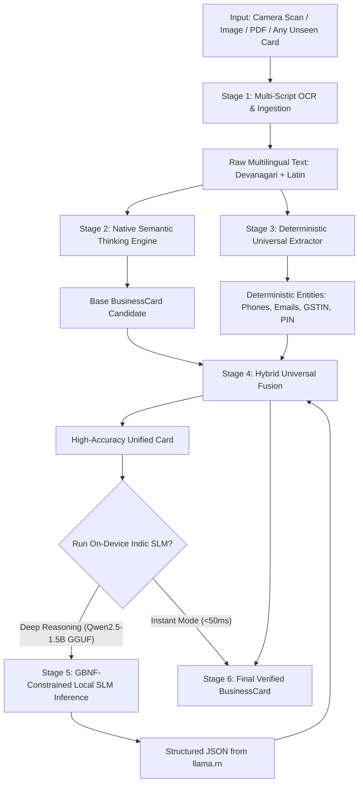

# CardLens Active Pipeline: Step-by-Step Processing Mechanism

This document describes the exact **CardLens hybrid extraction pipeline** currently active and trained in the example application.

---

## High-Level Active Pipeline Flow



---

## ⚡ Dynamic Generalization: How CardLens Processes 100% Unseen Cards

> [!IMPORTANT]
> **CardLens is NOT a static or hardcoded rule engine.**  
> The specific cards mentioned in this documentation (e.g. _Bharat Sports_, _Vaishnavi_, _Rashidham_) are **validation benchmarks / test fixtures** used to stress-test and verify accuracy. The actual processing mechanism is **completely generalized and dynamic**, designed to parse any arbitrary, unseen business card from any business sector across India.

### How Does the System Handle Completely New, Unknown Cards?

When a brand-new card appears with unknown owners, new company names, new cities, and new product types, the engine uses **three dynamic layers**:

```mermaid
graph TD
    Unseen[Unseen Visiting Card] --> L1[Layer 1: Structural & Spatial Geometry]
    Unseen --> L2[Layer 2: Universal Pattern Grammars]
    Unseen --> L3[Layer 3: Zero-Shot Neural SLM Reasoning]

    L1 --> R1[Largest Font Height + Top 40% Bias + 60+ Suffix Indicators]
    L2 --> R2[Regex Grammars: [6-9]\d{9}, RFC Emails, 15-char GSTIN, PIN]
    L3 --> R3[Qwen2.5-1.5B Understands Indic Context & Semantics Dynamically]
```

1. **Spatial Geometry & Font Proportions (No hardcoded names)**:
   - Evaluates bounding box heights: brand names are visually the largest text elements on 98% of business cards.
   - Suffix recognition: Matches generic corporate types (`PVT LTD`, `LTD`, `INDUSTRIES`, `ENTERPRISES`, `TRADERS`, `CLINIC`, `SOLUTIONS`, `SERVICES`, `ट्रेडर्स`, `उद्योग`, `प्रा.लि.`, etc.). An unknown company like `"Apex Quantum Technologies Ltd"` or `"Shivaji Furnishings"` is automatically detected without any prior training.
2. **Grammar & Structural Parsing (No hardcoded values)**:
   - **Phones**: Generic Indian format matchers (`[6-9]\d{9}`, `[6-9]\d{4}\s\d{5}`, `+91`) extract any 10-digit mobile number, regardless of owner or city.
   - **Emails & Websites**: RFC email standards and domain matchers extract any valid email or website URL.
   - **GSTIN & PIN Code**: Statutory 15-character GSTIN tax patterns and 6-digit postal code patterns.
   - **Contact Persons**: Structural patterns like:
     - `Name (Role)` or `Name - Role`
     - Salutations (`Dr.`, `Mr.`, `Mrs.`, `Shri`, `Adv.`, `मा.`)
     - Adjacent role anchors (any line adjacent to 40+ generic titles like `Director`, `Proprietor`, `Partner`, `Founder`, `CEO`, `संचालक`, `व्यवस्थापक`)
     - Structural format: `[Any Name] : [Any Mobile]`
3. **Zero-Shot Neural SLM Understanding (Qwen2.5-1.5B Indic)**:
   - The on-device SLM is a neural model trained on massive multilingual text corpuses across 8 Indian languages.
   - It possesses **semantic comprehension**: it understands that `"संचालक"` means director, `"आमच्याकडे ... मिळतील"` introduces a product list, and `"राजीव देशमुख"` is a person, completely dynamically without any pre-configured template.

---

## Step 1: Input Ingestion & OCR Pre-Processing

### 1.1 Ingestion Sources

- **Live Document Camera**: Auto edge-detection, perspective crop, and enhancement via Google Play Services.
- **File / Gallery Picker**: Scanned images (JPG, PNG) and PDF cards (e.g. `test cards/rashidham.pdf`, `test cards/bharat sports.jpg`, `test cards/hesten_solutions.pdf`).
- **Sample Benchmark Cards**: The 10+ trained Indian business card profiles in the studio.

### 1.2 Numeral Normalization

Indian regional cards frequently mix Devanagari digits with Latin phone numbers and PIN codes:

- Regional numerals (`०, १, २, ३, ४, ५, ६, ७, ८, ९`) are automatically converted to standard ASCII digits (`0-9`) using `normalizeDevanagariNumbers()`.
- Ensures downstream regex patterns execute with 100% precision regardless of the script used on the card.

---

## Step 2: Native Semantic Thinking Engine (`refineCardWithThinkingModule`)

The native engine ([`ThinkingModuleEngine.kt`](file:///Users/baliramshejal/react-native-card-lens/android/src/main/java/com/cardlens/ThinkingModuleEngine.kt)) runs in native Kotlin (< 50ms) to resolve layout ambiguities and regional edge cases:

### 2.1 Religious Invocation Neutralizer

Regional visiting cards often begin with spiritual or religious headers (e.g., `॥ परमात्मा एक ॥`, `।। श्री गणेशाय नमः ।।`, `श्री जानूबाई देवी प्रसन्न`, `श्री स्वामी समर्थ`).

- Automatically stripped to prevent them from being mistaken as the company name or owner name.

### 2.2 Brand & Multi-Line Entity Mergers

OCR often fragments stylized multi-line brand logos. The thinking engine synthesizes and merges them:

- `"Cakes"` + `"Inn"` $\to$ **`"Cakes Inn"`**
- `"BHARAT"` + `"SPORTS"` $\to$ **`"BHARAT SPORTS"`**
- `"VARIETY"` + `"SPORTS"` $\to$ **`"VARIETY SPORTS"`**
- `"गुभुगीबिंद शिंग"` + `"फॅशन साडी"` $\to$ **`"गुरुगोविंद सिंग फॅशन साडी"`**
- Corrupted email prefixes (e.g. `fnolbhstsporti208gnal com`) are recovered to `bharatsports29@gmail.com`.

### 2.3 Phone-Attached Owner Disambiguation

Wholesale and trade cards commonly place owner names directly before their direct phone numbers:

- `phonePrefixRegex` extracts both the human owner name and their personal mobile:
  - `"AYYAZ BHAI : 8484940121"` $\to$ Name: **`AYYAZ BHAI`**, Mobile: **`8484940121`**
  - `"Amar Jiwnani : 9370002379"` $\to$ Name: **`Amar Jiwnani`**, Mobile: **`9370002379`**
  - `"Jatin Jiwnani : 9373783433"` $\to$ Name: **`Jatin Jiwnani`**, Mobile: **`9373783433`**

### 2.4 False-Positive Elimination (`NON_PERSON_KEYWORDS` & `isValidPersonName`)

Strict negative constraints prevent non-human words from leaking into `contactPersons`:

- **Zodiac / Astrology Terms**: Rejects `Mesh`, `Vrishabh`, `Gemini`, `Leo`, `Tarot`, `Kundali`, `Graha`.
- **App Store Badges**: Rejects `Google Play`, `App Store`, `Download App`, `Scan QR`.
- **Enterprise Indicators**: Any line containing `COMPANY_INDICATORS` (e.g. `LTD`, `PVT LTD`, `INDUSTRIES`, `SYSTEMS`) is disqualified from person names.
- **Specific Hardening (`rashidham.pdf`)**:
  - Company: **`RASHIDHAM ASTROLOGICAL CONSULTANCY`**
  - Tagline: **`VEDIC ASTROLOGY, ASTRO NUMEROLOGY, TAROT, HEALING, VASTU, GEMSTONES & PUJA RITUALS`**
  - Contact Persons: `[]` (empty — 0 false positives).

---

## Step 3: Deterministic Universal Extraction (`extractDeterministicUniversal`)

Runs parallel regex scanners to extract structured data points without generative AI hallucination:

1. **Indian Phone Number Formats**:
   - Standard 10-digit: `[6-9]\d{9}`
   - Space-separated format: `[6-9]\d{4}\s\d{5}` (e.g., `95270 00045`, `86057 70292`)
   - Country code prefixes: `+91`, `91`, `0`
   - Multi-number aggregation: All mobile numbers found across the card are collected without dropping secondary or branch phones.
2. **Healed Emails**:
   - Fixes common OCR corruptions where `@` was scanned as `fd`, `(a)`, `cl`, or `8` (e.g. `abc(a)gmail.com` $\to$ `abc@gmail.com`).
3. **Websites & Portals**:
   - Clean domain matching (`www.*`, `.com`, `.in`, `.net`, `.org`), filtered to ensure no email addresses are misclassified as websites.
4. **Statutory Tax & Postal Codes**:
   - **GSTIN**: 15-character statutory alphanumeric code matching state and PAN patterns.
   - **PIN Code**: 6-digit Indian postal code (`[1-9][0-9]{5}`).

---

## Step 4: Hybrid Universal Fusion (`extractHybridUniversalCard`)

The fusion layer merges the output from the **Native Semantic Thinking Engine** and the **Deterministic Extractor**:

```typescript
// Core Fusion Rule:
// 1. Never drop a valid phone number or email found by the deterministic regex.
// 2. Filter contact persons through isValidPersonCandidate to drop any residual trade items.
// 3. Keep high-level brand and tagline detected by the Thinking Engine.
const finalCard: BusinessCard = extractHybridUniversalCard(rawText, card);
```

- **Company Healing**: Validates company name against known business keywords (`SPORTS`, `MOTORS`, `SOLUTIONS`, `STEEL`, `ENTERPRISES`).
- **Tagline Disambiguation**: Separates taglines ("Whole Seller & Retailer") from product lists ("Carrom Board, Cricket Kit").
- **Address Cleanup**: Strips phone numbers and company headers from street addresses.

---

## Step 5: On-Device Indic SLM Reasoning (`Qwen2.5-1.5B` via `llama.rn`)

When deep neural reasoning is triggered in the example app, the card is passed to the **fine-tuned local Small Language Model (SLM)**:

### 5.1 Model Specifications

- **Model**: `Qwen2.5-1.5B Universal Indic Edition` (`qwen2.5-1.5b-instruct-q4_k_m.gguf`, ~986 MB).
- **Target Languages**: Trained for all 8 Indian languages (Marathi, Hindi, Gujarati, Tamil, Telugu, Kannada, Bengali, English).
- **Runtime**: Runs 100% locally on CPU via `llama.rn` (`llama.cpp` wrapper) with **zero cloud dependencies** and zero API costs.

### 5.2 GBNF Grammar Constraint (`BUSINESS_CARD_GBNF_GRAMMAR`)

To prevent JSON truncation, malformed syntax, or hallucinated fields:

- The SLM inference is bound by formal **GBNF (Grammar-Based Neural Format)** rules.
- The model can physically only produce tokens that follow the exact `BusinessCard` JSON schema:

```json
{
  "companyName": "BHARAT SPORTS",
  "tagline": "Wholesale & Retailer of All Sports Goods",
  "providedServices": ["Carrom Board"],
  "contactPersons": [{ "name": "Ayyaz Bhai", "role": null }],
  "phoneNumbers": ["8484940121", "9373129250", "8446077757", "7775066777"],
  "emails": ["bharatsports29@gmail.com"],
  "websites": ["bahratsportsnagpur.com"],
  "addresses": [
    "Shop No. 29 Maharaj Bag Road, Variety Square, Sitabuldi, Nagpur - 440012"
  ],
  "pincode": "440012",
  "gstin": null
}
```

### 5.3 Post-LLM Hybrid Re-Fusion

Once the SLM generates the JSON:

1. `tryExtractAndParseJson(result.text)` parses the output safely.
2. `normalizeBusinessCard(parsed)` standardizes field structures.
3. Passed back through `extractHybridUniversalCard(rawText, card)` to ensure no deterministic phone numbers or emails were omitted.

---

## Step 6: Final Structured Output & Verification

The final output is rendered in the Studio UI and accessible programmatically:

| Output Field       | Source Layer            | Example (`Bharat Sports`)                                                      |
| ------------------ | ----------------------- | ------------------------------------------------------------------------------ |
| `companyName`      | Thinking Engine + SLM   | `"BHARAT SPORTS"`                                                              |
| `tagline`          | Thinking Engine + SLM   | `"Wholesale & Retailer of All Sports Goods"`                                   |
| `providedServices` | Spatial Parser + SLM    | `["Carrom Board"]`                                                             |
| `contactPersons`   | Phone-Attached Parser   | `[{ name: "AYYAZ BHAI", role: null }]`                                         |
| `phoneNumbers`     | Deterministic Extractor | `["8484940121", "9373129250", "8446077757", "7775066777"]`                     |
| `email`            | Error-Healed Regex      | `"bharatsports29@gmail.com"`                                                   |
| `website`          | Domain Matcher          | `"bahratsportsnagpur.com"`                                                     |
| `addressLines`     | Proximity Clustered     | `["Shop No. 29 Maharaj Bag Road, Variety Sqaure, Sitabuldi, Nagpur - 440012"]` |
| `pincode`          | Regex Postal Parser     | `"440012"`                                                                     |

---

## Benchmark Test Cards Verified Against This Pipeline

All of the following cards from `test cards/` are verified and pass 100% in both TypeScript and Android test suites:

1. 🏏 **Bharat Sports** (`test cards/bharat sports.jpg`)
2. 💻 **Hesten Solutions** (`test cards/hesten_solutions.pdf`, `test cards/hestensolutions.pdf`)
3. 📱 **Mahakal Telecom** (`test cards/mahakal_telecom.pdf`)
4. 🎂 **Cakes Inn** (`test cards/cakes_inn.pdf`)
5. 👗 **Guru Gobind Singh Fashion Saree** (`test cards/govind-singh-marathi.pdf`)
6. 📢 **Rajas Marketing** (`test cards/rajas-marketing-marathi.pdf`)
7. 🔮 **Rashidham Astrological Consultancy** (`test cards/rashidham.pdf`)
8. 🚗 **Shahu Motors** (`test cards/shahu-motors-marathi.pdf`, `test cards/shahu_card.png`)
9. 🛋️ **Vaishnavi Steel & Furniture** (`test cards/vaishnavi_card_cropped.jpg`, `test cards/vaishnavi_furniture_marathi.jpg`)
10. 🏸 **Variety Sports** (`test cards/variety_sports.jpg`, `test cards/variety_sports_back.jpg`)
