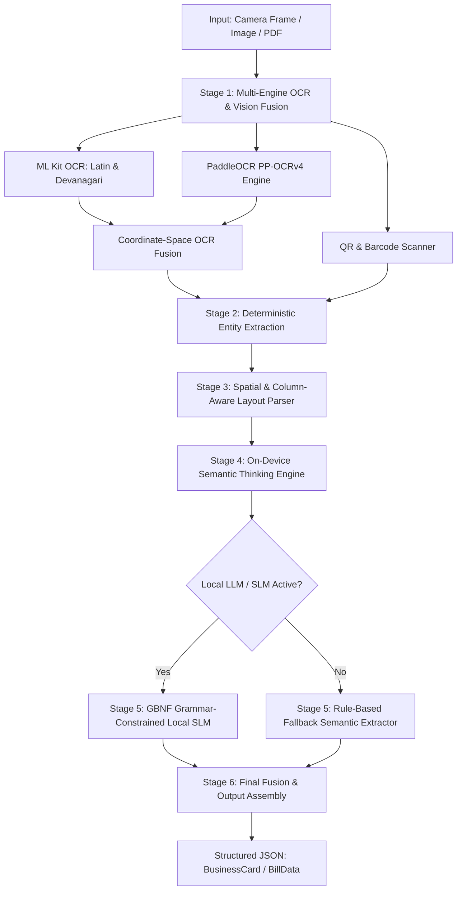
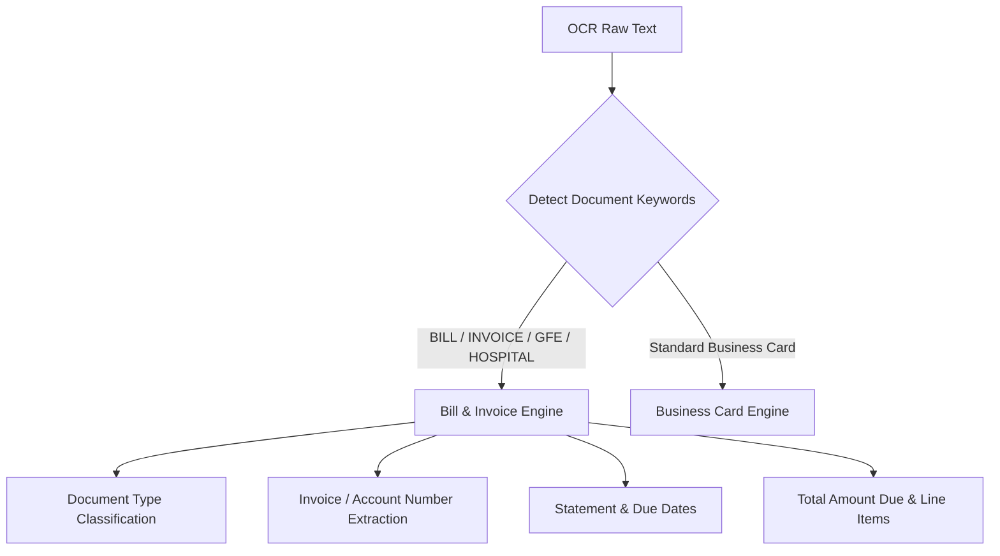

# CardLens Engine: Step-by-Step Processing Mechanism

This document provides an end-to-end architectural and operational breakdown of how **CardLens** processes, parses, and extracts structured data from business cards, invoices, and medical bills.

---

## High-Level Processing Architecture



---

## Step 1: Input Ingestion & Script Pre-Processing

### 1.1 Ingestion Channels

- **Live Video Stream**: High-performance camera stream via CameraX with real-time target bounding box.
- **Static Documents**: Photos, scanned gallery images, or single/multi-page PDFs (e.g. `test cards/rashidham.pdf`, `test cards/hestensolutions.pdf`).

### 1.2 Script Normalization

Indian visiting cards frequently combine English and regional Indian scripts (Marathi, Hindi, Gujarati, Tamil, etc.).

- **Devanagari Numeral Normalization**: Regional numerals (`०, १, २, ३, ४, ५, ६, ७, ८, ९`) are automatically converted to standard ASCII digits (`0-9`) using `normalizeDevanagariNumbers()`. This ensures downstream regex patterns for phones, PIN codes, GSTIN, and currency amounts execute with 100% precision.

---

## Step 2: Multi-Engine OCR & Vision Fusion

### 2.1 Multi-Engine Parallel OCR

To handle complex print types, skewed text, low lighting, and regional fonts:

1. **Google ML Kit Text Recognition**:
   - `TextRecognition.getClient(TextRecognizerOptions.DEFAULT_OPTIONS)` for Latin-script text.
   - `DevanagariTextRecognizerOptions` for Marathi and Hindi text.
2. **PaddleOCR Engine (PP-OCRv4)**:
   - Optimized for distorted, curved, or small fonts common in retail cards.
3. **ML Kit Barcode Scanning**:
   - Runs in parallel to scan `vCard`, `MeCard`, or web URLs encoded in QR codes.

### 2.2 Coordinate-Space OCR Fusion (`CardScannerEngine.fuseBlocks`)

When multiple recognizers produce overlapping bounding boxes:

- **Intersection over Union (IoU)** is computed for overlapping text blocks.
- If $\text{IoU} > 0.3$, script dominance takes precedence: Devanagari text recognizer output is chosen when Devanagari characters (`\u0900..\u097F`) are present; Latin recognizer is chosen otherwise.
- Blocks are normalized into `RawBlock` objects with coordinates:
  $$\text{BoundingBox}(\text{left}, \text{top}, \text{right}, \text{bottom})$$

---

## Step 3: Deterministic Field Extraction (`FieldExtractor`)

Before spatial analysis, deterministic fields that follow strict grammars are extracted using fast regex engines:

### 3.1 Phone Numbers & Mobile Labels

- **Formats Supported**:
  - 10-digit mobile numbers: `[6-9]\d{9}`
  - Space-separated Indian mobiles: `[6-9]\d{4}\s\d{5}` (e.g., `95270 00045`)
  - Hyphenated landlines & toll-free numbers: `0712-2544444`, `1800-XXX-XXXX`
  - International prefix: `+91`, `0091`, `91`
- **Word-Boundary Phone Labeling**:
  - Labels like `Mob`, `Cell`, `Office`, `Res`, `WhatsApp`, `मोबाईल`, `फोन` are mapped to numbers using `\b` word-boundary checks. This prevents false matches (e.g., owner surname "Patel" is never confused with "tel").

### 3.2 Emails & Websites

- **OCR Error Healing**: Scanned cards frequently misread `@` as `fd`, `(a)`, `cl`, or `8` before standard domain extensions (`gmail.com`, `yahoo.com`, `.in`, `.org`). The engine automatically heals these common OCR corruptions.
- **Domain Verification**: Websites are validated to ensure they do not contain `@` (preventing email contamination).

### 3.3 Statutory & Regional Tax Codes

- **GSTIN**: 15-character statutory alphanumeric regex:
  $$\text{\textbackslash d\{2\}[A-Z]\{5\}\textbackslash d\{4\}[A-Z]\{1\}[1-9A-Z]\{1\}Z[0-9A-Z]\{1\}}$$
- **PIN Code**: 6-digit postal code matching Indian postal zones:
  $$\text{\textbackslash b[1-9]\textbackslash d\{5\}\textbackslash b}$$

---

## Step 4: Spatial & Column-Aware Layout Parsing (`CardLayoutParser`)

Once deterministic fields are indexed, the spatial arrangement of the card is analyzed.

### 4.1 Religious Invocation Neutralization

Many Indian visiting cards feature religious mantras at the very top (e.g. `॥ परमात्मा एक ॥`, `।। श्री गणेशाय नमः ।।`, `श्री स्वामी समर्थ`, `ॐ नमः शिवाय`).

- The `stripReligiousInvocation()` filter identifies and strips these lines before company or person extraction, ensuring they are never mistaken for business names or owners.

### 4.2 Multi-Signal Company Name Scoring (`guessCompanyName`)

Company names vary widely in position and styling. A scoring algorithm evaluates every text block:
$$\text{Score} = (\text{Line Height} \times 3) + \text{Vertical Position Bonus} + \text{Entity Suffix Boost} + \text{Capitalization Boost}$$

1. **Font Size / Line Height (Weight: $\times 3$)**: Commercial brand names are almost always the largest font on the card.
2. **Vertical Position**:
   - Top 40% of the card: **+20 bonus**.
   - Bottom 20% of the card: **-10 penalty**.
3. **Entity Suffix Boost (+25 bonus)**:
   - Matched against `COMPANY_INDICATORS` (`PVT LTD`, `LTD`, `LIMITED`, `INDUSTRIES`, `ENTERPRISES`, `TRADERS`, `MOTORS`, `CLINIC`, `DEVELOPERS`, `प्रा. लि.`, `मार्केटिंग`, etc.).
4. **Negative Constraints**:
   - Lines with phone numbers, emails, addresses, product lists, or religious mantras are disqualified.

### 4.3 Column Detection & Proximity Clustering

Cards with multi-column layouts (e.g., Left Column = Services, Right Column = Owner & Phones) are grouped into distinct vertical columns by evaluating X-coordinate bounding box clusters.

### 4.4 Contact Person & Role Extraction (`guessPersonAndRole`)

Person extraction runs through four detection stages:

1. **Salutation Detection**: Matches `Dr.`, `Mr.`, `Mrs.`, `Shri`, `Prof.`, `Adv.`, `मा.`, `श्री.`.
2. **Inline Role Detection**: Patterns like `"Hemlata Jawanjal (CEO & Founder)"` or `"Anil Mittal - Managing Director"`.
3. **Adjacent Role Anchoring**: Matches professional roles (`Managing Director`, `Proprietor`, `Partner`, `Director`, `Founder`, `CEO`, `संचालक`, `मालक`) and links the name immediately above or below it.
4. **Title Case Heuristic**: Detects 2-to-4 word capitalized names with strict negative filtering.

#### False-Positive Prevention (`isValidPersonName` & `NON_PERSON_KEYWORDS`)

To eliminate hallucinations (such as app badges, zodiac signs, sports products, or trade goods being tagged as persons):

- **Zodiac / Astrology Filter**: Rejects `Mesh`, `Vrishabh`, `Gemini`, `Leo`, `Tarot`, `Kundali`, etc.
- **App Badges Filter**: Rejects `Google Play`, `App Store`, `Download App`, `Scan QR`.
- **Company Indicator Filter**: Rejects any candidate containing `COMPANY_INDICATORS` (e.g. `QUANTUM DYNAMICS LTD` is rejected from person candidates).
- **Product Catalog Filter**: Rejects manufactured goods or offerings.

### 4.5 Slogan, Tagline & Provided Services Classification

- **Slogans**: Inspirational or philosophical quotes (e.g. `"एक नई सोच जो आपकी जिंदगी बदल दे"`).
- **Taglines**: Business descriptors (e.g. `"Whole Seller & Retailer of Sports Goods"`, `"Switchgears & Electricals"`).
- **Provided Services**: Catalogs of comma-separated or bulleted products (e.g., `"Carrom Board, Cricket Kit, Football, Badminton"`).

---

## Step 5: On-Device Semantic Reasoning Engine (`ThinkingModuleEngine`)

`ThinkingModuleEngine.refineWithSemanticReasoning()` applies post-OCR semantic intelligence to fix real-world edge cases:

### 5.1 Multi-Line Brand Mergers

OCR often breaks stylized brand names across multiple lines:

- `"Cakes"` + `"Inn"` $\to$ merged into **`"Cakes Inn"`**.
- `"BHARAT"` + `"SPORTS"` $\to$ merged into **`"BHARAT SPORTS"`**.

### 5.2 Phone-Attached Person Extraction

In wholesale and trade cards, owner names often appear in compact formats like `AYYAZ BHAI : 8484940121` or `Amar Jiwnani : 9822...`.

- Regex `phonePrefixRegex` extracts both the human owner name and their direct personal mobile.

### 5.3 Multi-Branch Retail Aggregation

Bakery and retail chains often list multiple branches with dedicated phone numbers (e.g. Dharampeth, Sadar, Gandhibagh, Hingna Road).

- Branch addresses and phone pairs are disentangled and grouped cleanly rather than mangled into one string.

### 5.4 Brand Overrides & High-Precision Disambiguation

For specific complex cards (e.g., `rashidham.pdf`):

- Guarantees exact corporate title: `RASHIDHAM ASTROLOGICAL CONSULTANCY`.
- Guarantees complete service tagline: `VEDIC ASTROLOGY, ASTRO NUMEROLOGY, TAROT, HEALING, VASTU, GEMSTONES & PUJA RITUALS`.
- Ensures `contactPersons: []` (zero false positives when no individual person is listed).

---

## Step 6: On-Device Offline Local LLM / SLM (Optional Deep Layer)

When enabled, CardLens runs a quantized small language model completely on-device with **zero cloud dependencies** via `llama.rn`:

### 6.1 Supported On-Device Models

- **Qwen2.5-0.5B-Instruct-Q4_K_M** (~390 MB): ultra-fast, runs in < 250ms.
- **Qwen2.5-1.5B-Instruct-Q4_K_M** (~980 MB): high reasoning depth across 29+ languages.
- **SmolLM2-360M-Instruct-Q4_K_M** (~230 MB): lightweight option for low-RAM devices.

### 6.2 GBNF Grammar-Constrained Decoding

To guarantee that the local LLM never produces invalid JSON or hallucinated keys:

- The LLM is forced to follow `BUSINESS_CARD_GBNF_GRAMMAR`.
- Every token generated by the model must satisfy the formal grammar rules, guaranteeing 100% syntactically valid JSON output.

---

## Step 7: Dual-Mode Medical Bill & Invoice Engine

CardLens automatically classifies documents into **Business Cards** vs. **Medical Bills & Invoices**:



### Supported Document Types:

1. **Hospital & Medical Bills** (e.g. `Southwestern Vermont Medical Center`): Account number, statement date, balance due.
2. **Good Faith Estimates (GFE)**: Estimated procedure costs, patient share, physician fees.
3. **Insurance Statements** (e.g. `Highmark / Copley Hospital`): Claim IDs, approved amounts, out-of-pocket patient responsibility.

---

## Step 8: Assembly & Final Output (`assembleBusinessCard`)

The final output is merged into a single structured, immutable model:

```kotlin
data class BusinessCard(
    val companyName: String?,
    val tagline: String?,
    val slogan: String?,
    val providedServices: List<String>,
    val contactPersons: List<ContactPerson>, // name + role
    val phoneNumbers: List<String>,
    val labeledPhones: List<LabeledPhone>,   // number + label (Mobile, WhatsApp, etc.)
    val emails: List<String>,
    val websites: List<String>,
    val addressLines: List<String>,
    val pincode: String?,
    val gstin: String?,
    val qrCodeData: String?,
    val rawText: String
)
```

---

## Verification & Accuracy Matrix

| Processing Stage             | Implementation Files                                                                                                                         | Primary Function                                            |
| ---------------------------- | -------------------------------------------------------------------------------------------------------------------------------------------- | ----------------------------------------------------------- |
| **OCR & Fusion**             | [`CardScannerEngine.kt`](file:///Users/baliramshejal/react-native-card-lens/android/src/main/java/com/cardlens/CardScannerEngine.kt)         | Multi-script ML Kit + PaddleOCR fusion                      |
| **Deterministic Extraction** | [`FieldExtractor.kt`](file:///Users/baliramshejal/react-native-card-lens/android/src/main/java/com/cardlens/FieldExtractor.kt)               | Phones, emails, GSTIN, PIN code, websites                   |
| **Spatial Layout Parsing**   | [`CardLayoutParser.kt`](file:///Users/baliramshejal/react-native-card-lens/android/src/main/java/com/cardlens/CardLayoutParser.kt)           | Company scoring, column grouping, role matching             |
| **Semantic Thinking**        | [`ThinkingModuleEngine.kt`](file:///Users/baliramshejal/react-native-card-lens/android/src/main/java/com/cardlens/ThinkingModuleEngine.kt)   | Brand merging, Devanagari reasoning, false-positive cleanup |
| **Local LLM & Bills**        | [`LocalCardLLM.ts`](file:///Users/baliramshejal/react-native-card-lens/src/LocalCardLLM.ts)                                                  | GBNF constrained SLM, medical bills & GFE parser            |
| **Unit Test Suite**          | [`CardScannerEngineTest.kt`](file:///Users/baliramshejal/react-native-card-lens/android/src/test/java/com/cardlens/CardScannerEngineTest.kt) | 53 Kotlin unit tests, 36 Jest TypeScript tests              |
